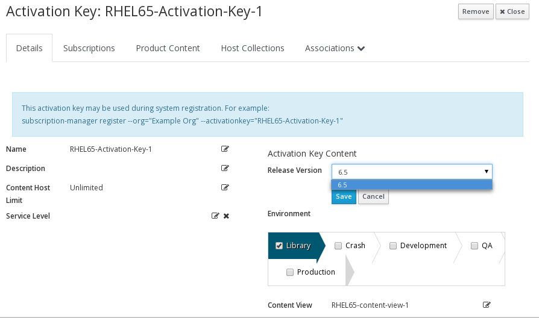
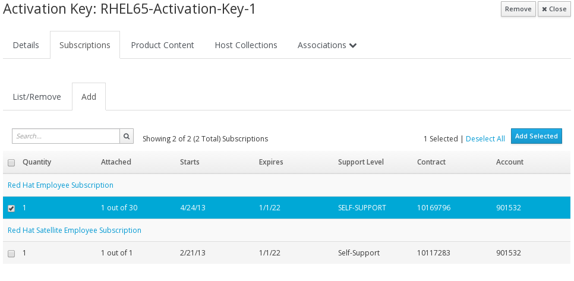

# Activation Keys

Now we shall create an Activation Key.

>**NOTE** Unfortunately the version of subscription manager shipped in RHEL6.5 (and below) does not function correctly with Activation Keys. The default **subscription_manager_registration** snippet has a fix to ensure that the RH Common repo is included, so that provisioning should work fine.
RHEL6.6 and RHEL7 do work correctly.

>**NOTE** Satellite can provision and update RHEL5 machines as well as RHEL6/7 but just like RHEL6.5, subscription-manager wasn't introduced until around RHEL 5.7

Before doing this step, make sure your **Content View** has finished publishing

To create an activation key - click

```Content > Activation Keys```

followed by the **New Activation Key** button. Fill in the Name, select the **Lifecycle Environment** and **Content View** and click **Save**

Once the key is created, make sure that the **Release Version** is set



and then go to the **Subscriptions** tab, to add your subscriptions.



Optionally, take a look on the **Product Content** to see if you you want change any of the defaults
