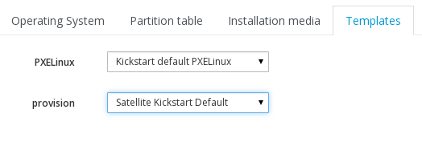

# Operating systems

Next we configure the **Operating Systems**. As my Satellite is running RHEL 6.5, the installation has already created one entry for me, but we need to make the following changes. Go to

```Hosts > Operating Systems```

On the first tab, ensure that the **Architectures** entry has **x86_64** ticked

On the **Partition Table** make sure that **Kickstart Default** is ticked


On the **Templates** tab, select the provisioning templates I mentioned earlier



and then hit **Submit**
