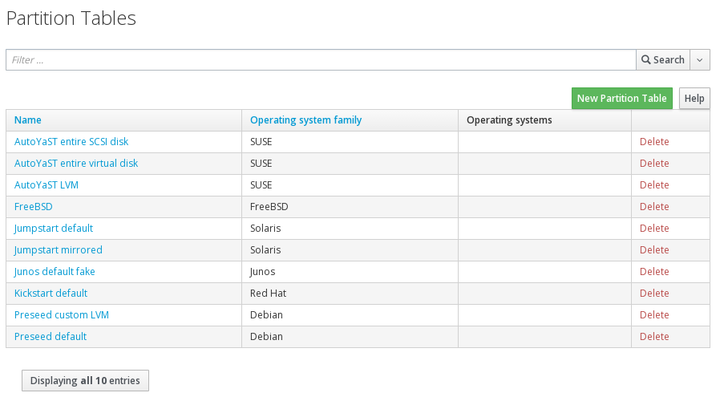

# Partition Tables

Next we check that our **Partition tables** are visible in our Org/Location. This should have been setup by the installer.

With your orgainisation and location selected, go to

```Hosts > Partition Tables```

and check that you can see **Kickstart Default** in there



