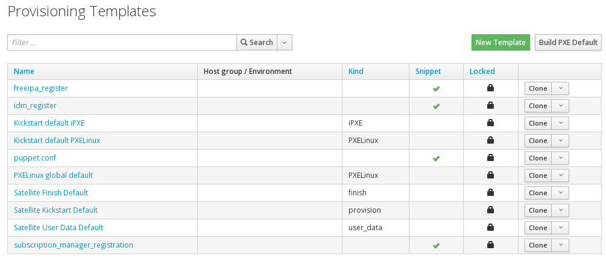
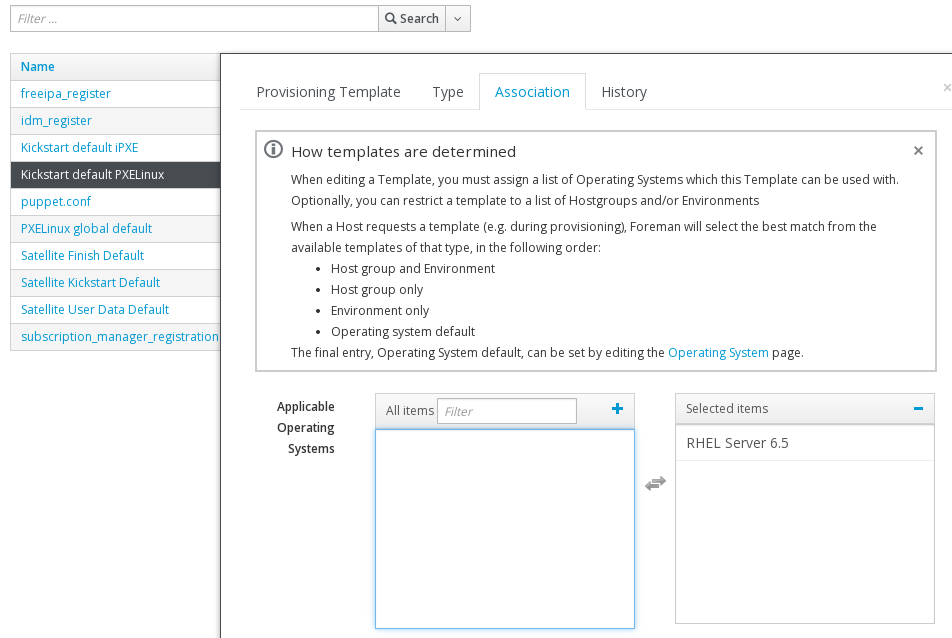

# Provisioning Templates

One of the changes from the beta version is that read only copies of provisioning templates are copied to your location and organisation but they are read only copies.

If you want to change one of them, then you will need to clone it

This is a nice last minute change (from the beta) as editing one template no longer affects other orgs. You can see this from the small padlocks in the **Locked** Column

The two that we require for provisioning are **Kickstart default PXELinux** and **Satellite Kickstart Default**. The later brings in the **subscription_manager_registration** snippet also

Only one change is required at this point. For both  **Kickstart default PXELinux** and **Satellite Kickstart Default** click on them and go to the Association tab and associate them to the **Operating System** - in this case **RHEL Server 6.5**

