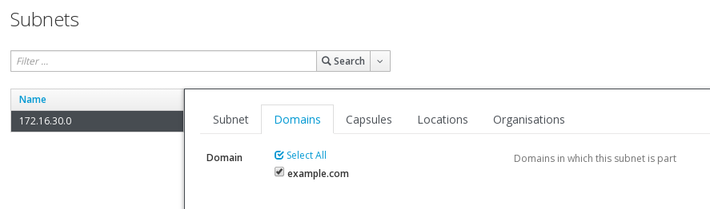
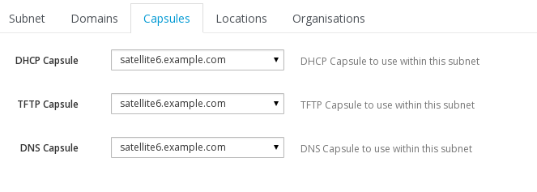

# Subnets

The next stop is to verify that our subnet is visible under our Org/Location. Navigate to

```Infrastructrue > Subnets```

If you cant see any, swicth to Any Organisation / Any Location and see if its there. If it is, then make sure that you move it to your Org/Location

If you cant see it, then maybe we need to **Import Subnets** from our **Capsule**

Navigate to

Infrastructure > Capsules and use the pull down menu on your severs entry to **Import Subnets**


This will open up the **Import subnets** dialog. Fill in the details that are appropriate to your network segment


Once its created, click on it again and verify that its visible to your Location / Organisation.

While we are there, we will link our **Domain** to our **Subnet** from the **Domains** tab, by ticking the box



Next we will set our **Capsules** from the **Capsule** tab



Finally we hit **Submit**
