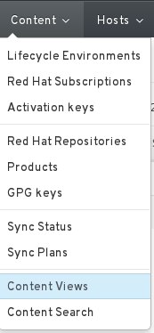
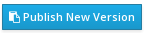

# Defining Content Views

Once the repositories that we need are synchronised, we can get our content view created. The content view will create a frozen view of the repositories until further updates are added to it and published

Click on the **Content > Content Views** menu

Fill in the **Name** and **Label** fields and click **Save**

On the **Content** tab, selected the repositories that you want to add to this view and click **Add Repositories**

As a bare minimum, for provisioning you will need (or the RHEL7 equivalent):

* Red Hat Enterprise Linux 6 Server Kickstart x86_64 6.5
* Red Hat Enterprise Linux 6 Server - RH Common RPMs x86_64

Depending on if you have changed the **Provision Template** you may also need

* Red Hat Enterprise Linux 6 Server RPMs x86_64 6.5

If you want to include some Puppet Repositories, feel free, but for now we can leave those out. They will be covered later on.

Now we need to **Publish** a new version of our **Content View** so that we can use it. Simply click the **Publish New Version**

The process will take time, progress can be tracked on the **Tasks** tab
