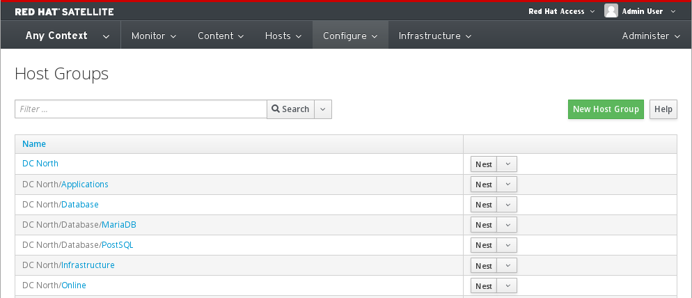

# Host Groups

Rather than applying settings to an individual host, Satellite 6 uses hostgroups.

Multiple **HostGroups** can be added and they can also be nested in a hierachal manner.

Examples
```
DC North
    Applications
    Database
        PostgSQL
        MariaDB
    Infrastructure
    Online

DC South
    Applications
    Database
        Oracle
        Mongo
    Infrastructure
    Online
        Webservers
```
The above heirachy would look like this in the UI



Configuration can be applied at any level.

For example, your DNS servers can be set at the top level (DC North/DC South) where as mailserver settings may be defined lower down the hierachy

