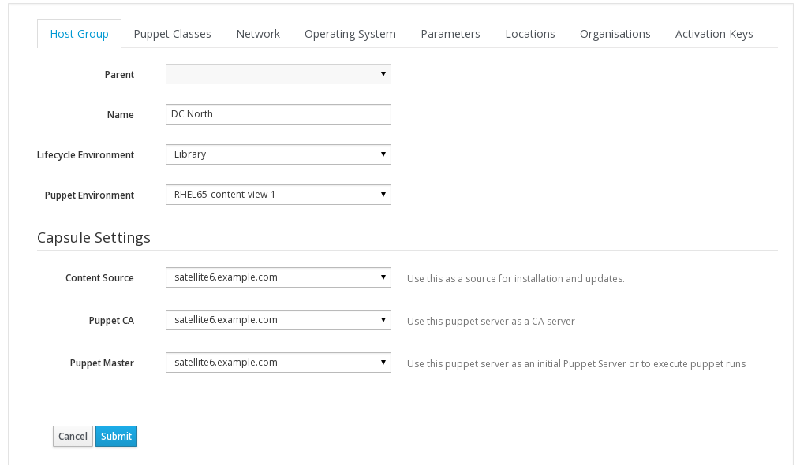
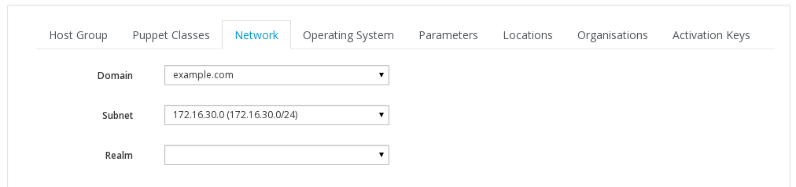
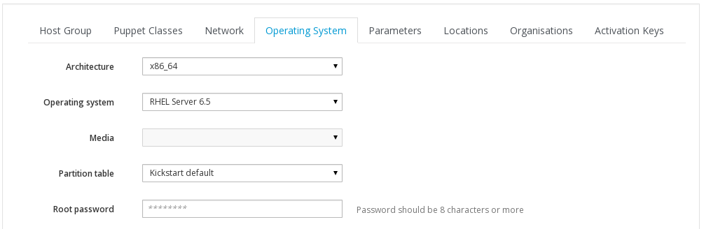
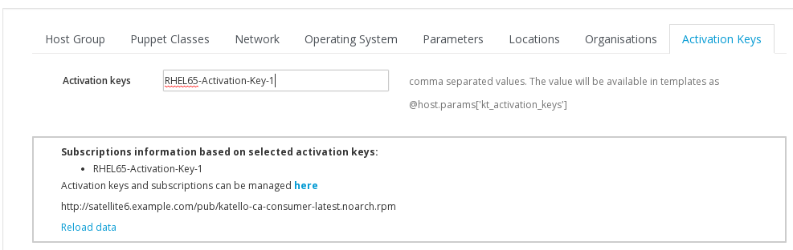

# Defining Host Groups

There are many things to set when you create a **Host Group** but this saves you having to define them for each host that you create later on. Below is the process for creating a **Host Group** called DC North

Start off by going to

```Configure > Host Groups```

and click on **New Nost Group**

Configure your **Host Group** as follows

**Host Group**



**Puppet Classes** - skip for now

**Network**



**Operating System**



**Parameters** - skip

**Locations** Verify your location is set

**Organisations** verify you organisation is set

**Activation Keys**



remember to hit **Submit**
