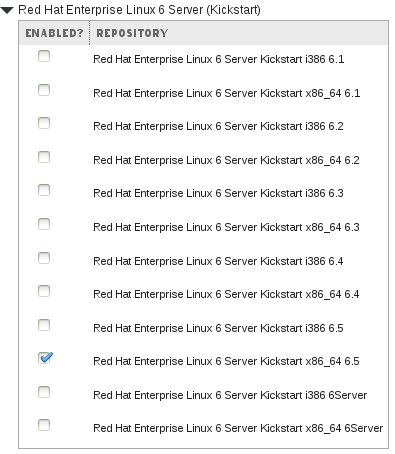
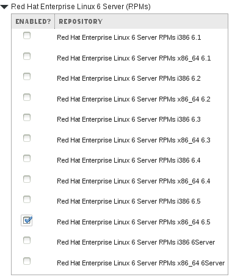
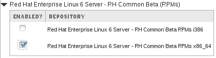

# Adding Red Hat Repositories

Once the manifest file has been imported, the repositories required need to be selected and syncronised

You will need three repositories at the very least to be selected

>*NOTE*: I shall focus on provisioning RHEL 6.5 hosts in my example but if you prefer to stick with the latest version, its better to use the **6Server** repository

Red Hat Enterprise Linux 6 Server _Kickstart_

Red Hat Enterprise Linux 6 Server _RPMs_

RH Common RPMs

