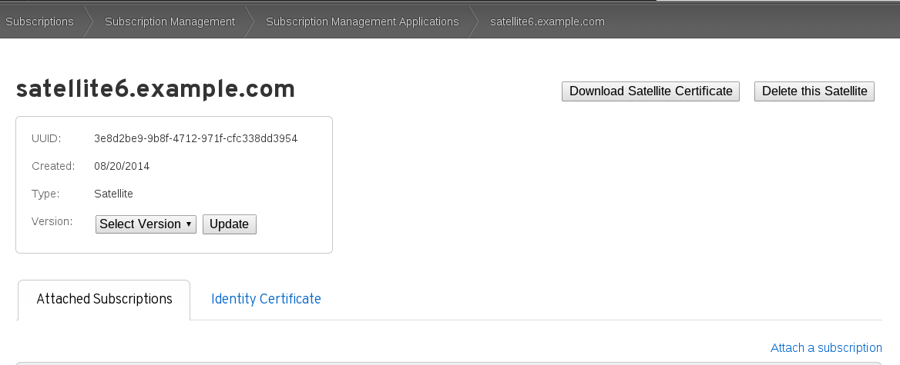
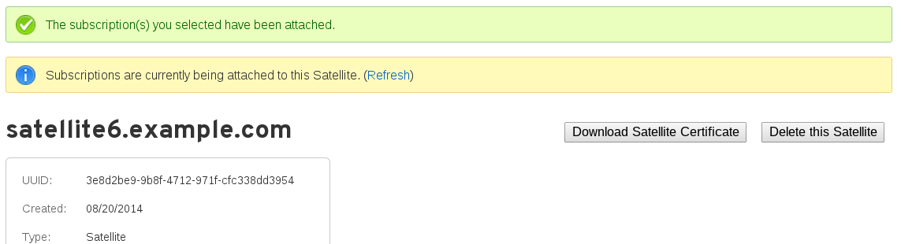

# Creating the Manifest

Login to [access.redhat.com](http://access.redhat.com) to generate our manifest file.

Locate the system, within [access.redhat.com](http://access.redhat.com).

Be sure to re-set the **Version**, if it has become unset (as in the screenshot below) and hit **Update**

>**NOTE**:
If the version of satellite you are not using isn't available in the list try using the previous version. For example, the Satellite 6.2 beta will accept a 6.1 manifest, though it will error, it will work fine.

Then locate the "Attach a subscription" (bottom right in the screenshot below).

Navigate to the subscription you wish to add, select the checkbox on the left and enter a quantity on the right before selecting **Attach Selected**

It may take some time to attach the subscription, as it will say on the screen (see screenshot below).

Hit refresh from time to time until it completes and then click on the **Download Manifest** button and save the manifest somewhere safe
