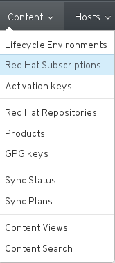
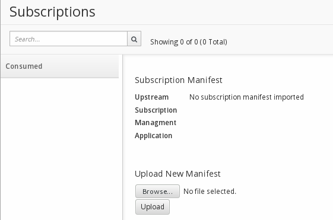

# Importing the Manifest

Now that we have out Organisation and Location created, we should switch to them in order to import our manifest to the correct place

In the first drop down menu, select your **Organisation** and **Location**  In my case these were "Example Org" and "Europe"

The left side of your menu bar should look like this

Select **Red Hat Subscriptions** from the **Content** menu

Use the **Browse** and **Upload** buttons to locate and upload the manifest you downloaded earlier

Once that has imported successfully, you can proceed to selecting the Red Hat Repositories you wish to syncronise
