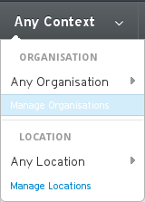

# Prepare for Manifest Import

Once the manifest has been created, we simple need to import it into our Satellite server.

However, first we must create our **Organization** and **Location**

Login to the Satellite web interface and select the Manage Organisation menu item

Click on the New Organisation button

 

and fill in the entries on the first page and hit submit

This takes you to the second page (seen below). Here it is asking where to assign the existing node (the Satellite server itself)

Click the green **Assign All**

Now you will see that your new organisation has been created

Follow a similar process to create a **location**. I created a location called Europe
