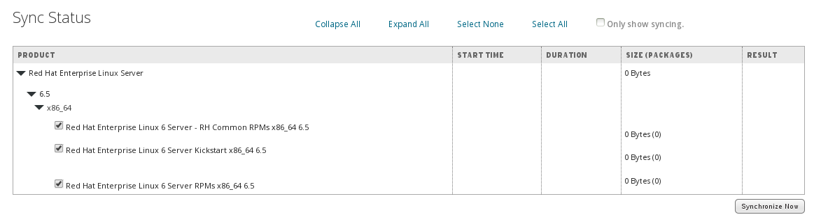

# Syncronising Repositories

As mentioned at the earlier, repositories syncronisation can either be manually syncronised or configured to syncronise on  a schedule

>*NOTE*: It is highly recommended that you use a sync plan to regularly syncronise repositories.

At this stage lets get the Red Hat repositories, that we need for provisioning to work, downloaded.

Select **Sync Status** from the **Content** menu

Click on the **Expand All** and **Select All** links and click on the **Synchronise Now** button

We will leave other Repsoitory types until later but there is no need to wait for those repositories to sync, we can proceed to **Lifecycle Environments** next
