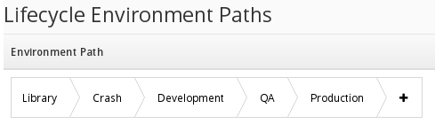

# Lifecycle Environments

Satellite 6 has the concept of **Lifecycle Environments**. These should generally match the names of your tiers, such as **Crash,** **Development,** **QA,** **Production** etc etc

The idea is that your hosts or clients will exist in one of these tiers. A **Content View** describing how the host should be configured is defined and pushed or **promoted** to the first tier (Crash in our example) where it is tested and refined before it is promoted to the next environment for the next team to test. We will discuss **Content Views** in another section

Creating **Lifecycle Environments** is easy, simple select **Lifecycle Environments** from the **Content** Menu and click on **New Environment Path**

Here is an example I created for the book, by defualt all repositories download to the built-in **Library** Environment.

In this book we shall be using the **Library** environment for simplicity. In reality you should be promting content to other environments.

