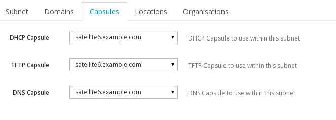
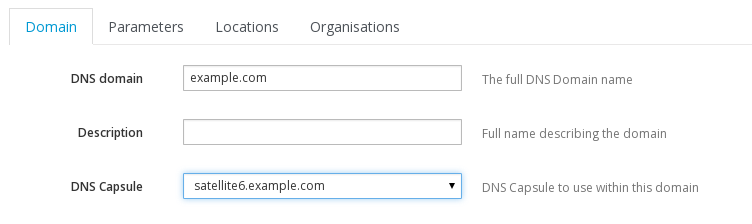

###Capsules / Proxies

If you are using DHCP / TFTP / DNS proxies, its always worth double-checking your definitions.

####Subnet
Go to you **Subnet** definition (Infrastructure > Subnets), and make sure that the **Capsules** page has the correct entries on it.

####Domains
If you are using a DNS proxy, also verify the **Domain** entry (Infrastructure > Domains) has the **DNS Capsule** correctly set

