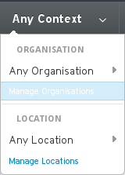
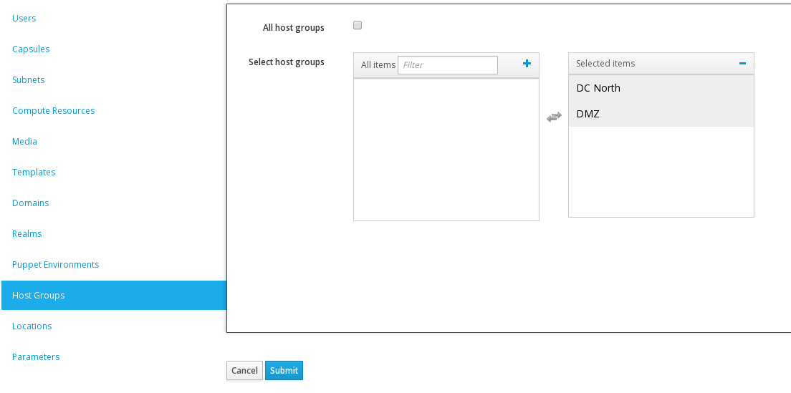
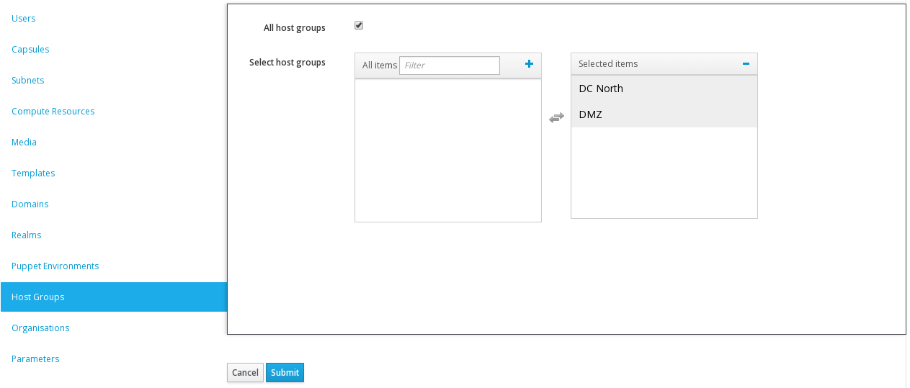

###Locations and Organisations

These are relatively new in the development lifecycle, and while the GA is better than the beta, there is still room for improvement.

One of the quickest ways to ensure that everything you need is available in your **Organisation** and **Location** is to go to **Manage Organisations** in the first menu.

Select your **Organisation** and scroll down until you see a list on the left of each of the components. Click on each one and verify that it is in the **Selected Items** panel

Do exacy the same from the **Manage Locations** interface

